# Dependencies

This page catalogs the third-party dependencies bundled with Node.js v26.0.0-pre, the build flags
that select them, and the automation that keeps them up to date. The version stamps for this
catalog are `NODE_MAJOR_VERSION 26`, `NODE_MODULE_VERSION 144`, sourced from `src/node_version.h`.

For per-dependency maintainer guidance (security policy, branch strategy, upstream coordination), see
the [`../contributing/maintaining/`](../contributing/maintaining/) subfolder.

## Bundled vs shared

Node.js builds statically link the bundled dependencies into the `node` binary by default. A subset
of dependencies can also be linked dynamically against system libraries by passing
`--shared-<lib>` to `./configure`. The default behavior is bundling; the shared-library variants are
available for distributions that prefer system packages.

```mermaid
flowchart LR
    Configure["./configure<br/>configure.py"] --> Toggles
    subgraph Toggles[Build toggles in common.gypi / node.gyp]
        T1[node_use_openssl: true]
        T2[node_use_amaro: true]
        T3[node_use_sqlite: true]
        T4[node_use_v8_platform: true]
        T5[node_use_bundled_v8: true]
        T6[node_shared_openssl: false]
        T7[node_shared_zlib: false]
    end
    Toggles --> Build[GYP -> compile -> link]
    Build --> Binary((node binary))
    Binary -->|statically linked| Deps

    subgraph Deps[Bundled dependencies under deps/]
        V8[V8<br/>embedder string -node.17]
        Libuv[libuv]
        OpenSSL[OpenSSL]
        Nghttp2[nghttp2]
        Cares[c-ares]
        Undici[undici]
        ICU[ICU]
        SQLite[SQLite]
        Amaro[Amaro<br/>SWC WASM]
        Simdutf[simdutf]
        Zlib[zlib]
        Brotli[brotli]
        Zstd[zstd]
        Ngtcp2[ngtcp2]
        Nghttp3[nghttp3]
        Llhttp[llhttp]
        Acorn[Acorn]
        Histogram[Histogram]
        Postject[Postject]
        UVwasi[uvwasi]
    end

    classDef stage fill:#e6f0ff,stroke:#0058a3,color:#000
    classDef dep fill:#fff5e6,stroke:#cc7a00,color:#000
    classDef bin fill:#ffe6e6,stroke:#990000,color:#000,stroke-width:2px
    class Configure,Build,Toggles stage
    class V8,Libuv,OpenSSL,Nghttp2,Cares,Undici,ICU,SQLite,Amaro dep
    class Simdutf,Zlib,Brotli,Zstd,Ngtcp2,Nghttp3,Llhttp dep
    class Acorn,Histogram,Postject,UVwasi dep
    class Binary bin
```



## Dependency matrix

The list below catalogs the major bundled dependencies. For each, the source location under
`deps/`, the GYP toggles that gate its inclusion, and the canonical `tools/dep_updaters/` updater
script are listed. Maintainer guides under [`../contributing/maintaining/`](../contributing/maintaining/)
host per-dependency policies (security, branch strategy, upstream coordination); deps without a
dedicated guide follow the general bundled-deps policy.

### V8

* **Purpose**: JavaScript engine, ECMAScript runtime
* **Source**: `deps/v8/`
* **Toggles**: `node_use_v8_platform`, `node_use_bundled_v8`, `node_shared_v8`; embedder string
  `v8_embedder_string: '-node.17'` (declared in `common.gypi`)
* **Updater**: `tools/dep_updaters/update-v8-patch.sh`
* **Maintainer guide**:
  [`../contributing/maintaining/maintaining-V8.md`](../contributing/maintaining/maintaining-V8.md)

### libuv

* **Purpose**: Cross-platform async I/O (event loop, file system, networking, timers)
* **Source**: `deps/uv/`
* **Toggles**: `node_shared_libuv`
* **Updater**: `tools/dep_updaters/update-libuv.sh`
* **Maintainer guide**: see component-in-core notes

### OpenSSL

* **Purpose**: Cryptography primitives, TLS, FIPS-compliant builds
* **Source**: `deps/openssl/`
* **Toggles**: `node_use_openssl: true`, `node_shared_openssl: false`
* **Updater**: `tools/dep_updaters/update-openssl.sh`
* **Maintainer guide**:
  [`../contributing/maintaining/maintaining-openssl.md`](../contributing/maintaining/maintaining-openssl.md)

### nghttp2

* **Purpose**: HTTP/2 framing
* **Source**: `deps/nghttp2/`
* **Toggles**: bundled by default
* **Updater**: `tools/dep_updaters/update-nghttp2.sh`
* **Maintainer guide**:
  [`../contributing/maintaining/maintaining-http.md`](../contributing/maintaining/maintaining-http.md)

### c-ares

* **Purpose**: Asynchronous DNS resolution
* **Source**: `deps/cares/`
* **Toggles**: bundled by default
* **Updater**: `tools/dep_updaters/update-c-ares.sh`, `tools/dep_updaters/update-c-ares.mjs`
* **Maintainer guide**: general bundled-deps policy

### undici

* **Purpose**: HTTP/1.1 client backing the global `fetch()`
* **Source**: `deps/undici/`
* **Toggles**: bundled by default
* **Updater**: `tools/dep_updaters/update-undici.sh`
* **Maintainer guide**: general bundled-deps policy

### ICU

* **Purpose**: Internationalization (locale data, Unicode tables)
* **Source**: `deps/icu-small/` (small) or `deps/icu-tmp/` (full)
* **Toggles**: `--without-intl`, `--with-intl=full-icu`, `--with-intl=small-icu`,
  `--with-intl=system-icu`
* **Updater**: `tools/dep_updaters/update-icu.sh`
* **Maintainer guide**:
  [`../contributing/maintaining/maintaining-icu.md`](../contributing/maintaining/maintaining-icu.md)

### SQLite

* **Purpose**: Embedded SQL database backing `node:sqlite`
* **Source**: `deps/sqlite/`
* **Toggles**: `node_use_sqlite: true`
* **Updater**: `tools/dep_updaters/update-sqlite.sh`
* **Maintainer guide**: general bundled-deps policy

### Amaro

* **Purpose**: SWC-based TypeScript type stripper compiled to WASM
* **Source**: `deps/amaro/`
* **Toggles**: `node_use_amaro: true`
* **Updater**: `tools/dep_updaters/update-amaro.sh`
* **Maintainer guide**: general bundled-deps policy

### simdjson

* **Purpose**: SIMD JSON parsing
* **Source**: `deps/simdjson/`
* **Toggles**: bundled by default
* **Updater**: `tools/dep_updaters/update-simdjson.sh`
* **Maintainer guide**: general bundled-deps policy

### zlib

* **Purpose**: DEFLATE compression backing `node:zlib`
* **Source**: `deps/zlib/`
* **Toggles**: `node_shared_zlib`
* **Updater**: `tools/dep_updaters/update-zlib.sh`
* **Maintainer guide**: general bundled-deps policy

### brotli

* **Purpose**: Brotli compression backing `node:zlib` Brotli APIs
* **Source**: `deps/brotli/`
* **Toggles**: bundled by default
* **Updater**: `tools/dep_updaters/update-brotli.sh`
* **Maintainer guide**: general bundled-deps policy

### zstd

* **Purpose**: Zstandard compression backing `node:zlib` Zstd APIs
* **Source**: `deps/zstd/`
* **Toggles**: bundled by default
* **Updater**: `tools/dep_updaters/update-zstd.sh`
* **Maintainer guide**: general bundled-deps policy

### ngtcp2

* **Purpose**: QUIC transport (RFC 9000)
* **Source**: `deps/ngtcp2/`
* **Toggles**: bundled by default
* **Updater**: `tools/dep_updaters/update-ngtcp2.sh`
* **Maintainer guide**: general bundled-deps policy

### nghttp3

* **Purpose**: HTTP/3 over QUIC (RFC 9114)
* **Source**: `deps/nghttp3/`
* **Toggles**: bundled by default
* **Updater**: `tools/dep_updaters/update-nghttp3.sh`
* **Maintainer guide**: general bundled-deps policy

### llhttp

* **Purpose**: HTTP/1.1 message parser
* **Source**: `deps/llhttp/`
* **Toggles**: bundled by default
* **Updater**: `tools/dep_updaters/update-llhttp.sh`
* **Maintainer guide**:
  [`../contributing/maintaining/maintaining-http.md`](../contributing/maintaining/maintaining-http.md)

### uvwasi

* **Purpose**: WASI implementation backing `node:wasi`
* **Source**: `deps/uvwasi/`
* **Toggles**: `node_shared_uvwasi: false`
* **Updater**: `tools/dep_updaters/update-uvwasi.sh`
* **Maintainer guide**: general bundled-deps policy

### acorn / acorn-walk

* **Purpose**: JavaScript AST parser used by built-in tools
* **Source**: `deps/acorn/`
* **Toggles**: bundled by default
* **Updater**: `tools/dep_updaters/update-acorn.sh`, `tools/dep_updaters/update-acorn-walk.sh`
* **Maintainer guide**: general bundled-deps policy

### postject

* **Purpose**: SEA blob injector backing `node:sea`
* **Source**: `deps/postject/`
* **Toggles**: bundled by default
* **Updater**: `tools/dep_updaters/update-postject.sh`
* **Maintainer guide**:
  [SEA support maintainer guide](../contributing/maintaining/maintaining-single-executable-application-support.md)

### Histogram

* **Purpose**: Latency histogram primitive used by perf hooks
* **Source**: `deps/histogram/`
* **Toggles**: bundled by default
* **Updater**: `tools/dep_updaters/update-histogram.sh`
* **Maintainer guide**: general bundled-deps policy

### ada

* **Purpose**: URL parser (WHATWG URL)
* **Source**: `deps/ada/`
* **Toggles**: bundled by default
* **Updater**: `tools/dep_updaters/update-ada.sh`
* **Maintainer guide**: general bundled-deps policy

### nbytes

* **Purpose**: Byte-count helper
* **Source**: `deps/nbytes/`
* **Toggles**: bundled by default
* **Updater**: `tools/dep_updaters/update-nbytes.sh`
* **Maintainer guide**: general bundled-deps policy

### minimatch

* **Purpose**: Glob matcher used by built-in tooling
* **Source**: `deps/minimatch/`
* **Toggles**: bundled by default
* **Updater**: `tools/dep_updaters/update-minimatch.sh`
* **Maintainer guide**: general bundled-deps policy

### gyp-next

* **Purpose**: Maintained fork of GYP build configurator
* **Source**: `tools/gyp/`
* **Toggles**: n/a (build-time)
* **Updater**: `tools/dep_updaters/update-gyp-next.sh`
* **Maintainer guide**:
  [build files maintainer guide](../contributing/maintaining/maintaining-the-build-files.md)

### npm

* **Purpose**: Node.js package manager bundled with the runtime
* **Source**: `deps/npm/`
* **Toggles**: n/a
* **Updater**: `tools/dep_updaters/update-npm.sh`
* **Maintainer guide**: general bundled-deps policy

### googletest

* **Purpose**: C++ unit test framework backing `cctest`
* **Source**: `deps/googletest/`
* **Toggles**: n/a (test-time only)
* **Updater**: `tools/dep_updaters/update-googletest.sh`
* **Maintainer guide**: general bundled-deps policy

### inspector-protocol

* **Purpose**: Chrome DevTools Protocol JSON definitions
* **Source**: `deps/inspector-protocol/`
* **Toggles**: bundled by default
* **Updater**: `tools/dep_updaters/update-inspector-protocol.sh`
* **Maintainer guide**: general bundled-deps policy

### lief

* **Purpose**: Binary post-processing toolchain used by SEA
* **Source**: `tools/lief/`
* **Toggles**: n/a (build-time)
* **Updater**: `tools/dep_updaters/update-lief.sh`
* **Maintainer guide**: general bundled-deps policy

In addition, the `tools/dep_updaters/` directory ships scripts for refreshing root certificates
(`update-root-certs.mjs`), test426 fixtures (`update-test426-fixtures.sh`), nixpkgs pin
(`update-nixpkgs-pin.sh`), and `merve` (`update-merve.sh`).

## V8 patch tracking

The V8 embedder string is declared in `common.gypi`:

```text
'v8_embedder_string': '-node.17',
```

The trailing number (`17` at the time of writing) is incremented each time a Node.js-specific patch
is applied against `deps/v8/`. The patch series and the V8 update workflow are governed by
[`../contributing/maintaining/maintaining-V8.md`](../contributing/maintaining/maintaining-V8.md), and
the automation is the `tools/dep_updaters/update-v8-patch.sh` script (invoked by the GitHub Actions
`update-v8.yml` workflow).

## Build flags reference

The most relevant build flags from `common.gypi` and `node.gyp`:

| Flag                       | Default  | Effect                                                              |
| -------------------------- | -------- | ------------------------------------------------------------------- |
| `node_use_openssl`         | `true`   | Enable OpenSSL bindings (see note below)                            |
| `node_use_amaro`           | `true`   | Enable Amaro TypeScript type stripping for `--experimental-strip-types` |
| `node_use_sqlite`          | `true`   | Enable bundled SQLite for `node:sqlite`                             |
| `node_use_v8_platform`     | `true`   | Use V8's bundled libplatform implementation                         |
| `node_use_bundled_v8`      | `true`   | Link the bundled V8 (versus a system V8)                            |
| `node_use_node_snapshot`   | varies   | Embed a code snapshot to speed up startup (`--node-snapshot`)       |
| `node_use_node_code_cache` | varies   | Embed compiled core-module bytecode                                 |
| `node_shared`              | `false`  | Build the runtime as a shared library                               |
| `node_shared_openssl`      | `false`  | Link a system OpenSSL instead of the bundled copy                   |
| `node_shared_libuv`        | `false`  | Link a system libuv                                                 |
| `node_shared_zlib`         | `false`  | Link a system zlib                                                  |
| `node_shared_v8`           | `false`  | Link a system V8                                                    |
| `node_shared_uvwasi`       | `false`  | Link a system uvwasi                                                |
| `node_module_version`      | `''`     | Override the module ABI version at build time (see note below)      |

`node_use_openssl: true` is required for `node:crypto`, `node:tls`, `node:https`, `node:http2`,
and `node:webcrypto`. When `node_module_version` is left empty (the default), the build picks up
`NODE_MODULE_VERSION` from `src/node_version.h` (currently `144`).

The complete flag set (including platform-specific flags) is documented in
[`../../BUILDING.md`](../../BUILDING.md) and surfaced through `./configure --help`. The full list of
GYP variables is in `common.gypi` and `node.gyp`.

## Update automation and CI

Three GitHub Actions workflows automate dependency updates:

* `update-v8.yml` — invokes `tools/dep_updaters/update-v8-patch.sh` on a schedule, files a PR with
  the patched V8 tree
* `update-openssl.yml` — invokes `tools/dep_updaters/update-openssl.sh`, files a PR
* `update-wpt.yml` — invokes `tools/dep_updaters/update-test426-fixtures.sh` and refreshes the WPT
  vendoring under `test/wpt/`

Other deps are bumped manually using their respective `tools/dep_updaters/update-*.sh` scripts and
reviewed in regular PRs.

## Cross-references

* Architectural overview: [Architecture overview](overview.md)
* Feature catalog: [Feature catalog](features.md)
* Integration narrative: [Integration](integration.md)
* JavaScript runtime (V8 and libuv details): [JavaScript runtime](runtime.md)
* Cryptography (OpenSSL details): [Cryptography](cryptography.md)
* Networking (libuv, nghttp2, ngtcp2, nghttp3, c-ares, undici, OpenSSL): [Networking](networking.md)
* TypeScript (Amaro details): [TypeScript](typescript.md)
* Permission model: [Permission model](permission-model.md)
* Build and platform requirements: [`../../BUILDING.md`](../../BUILDING.md)
* Per-dependency maintainer guides:
  [`../contributing/maintaining/`](../contributing/maintaining/)
* Build files maintenance:
  [build files maintainer guide](../contributing/maintaining/maintaining-the-build-files.md)
* Cross-cutting dependency policy:
  [dependencies maintainer guide](../contributing/maintaining/maintaining-dependencies.md)
* Glossary of terms: [`../../glossary.md`](../../glossary.md)
