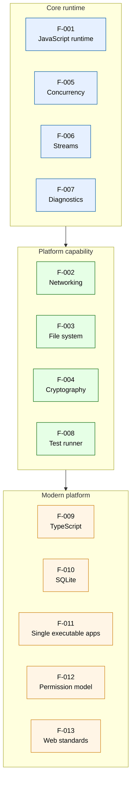

# Feature catalog

This page catalogs the 13 features shipped by Node.js v26.0.0-pre. Each feature is identified by a
stable `F-NNN` label and links to (1) its per-feature deep-dive in this directory, (2) its public API
reference under [`../api/`](../api/), and (3) the source paths that implement it.

The version stamps for this catalog are `NODE_MAJOR_VERSION 26`, `NODE_MODULE_VERSION 144`,
`NODE_API_SUPPORTED_VERSION_MAX 10`, `NODE_VERSION_IS_RELEASE 0`, sourced from `src/node_version.h`.

## Feature taxonomy

The features are grouped into three tiers reflecting their relationship to the runtime core:

The arrows indicate the conceptual dependency: the platform capabilities (Tier 2) build on the core
runtime (Tier 1), and the modern-platform features (Tier 3) build on both. The tiers are an analytical
grouping, not a build-time partition — every feature is part of the same `node` binary.

## Feature inventory

Each feature below lists its public modules, internal modules, native bindings, and API reference
pages. Cross-cutting features (F-012 Permission model, F-013 Web standards) reach across multiple
public modules and are covered in dedicated deep-dive pages.

### Tier 1 — Core runtime

The features that every Node.js process exercises during normal execution.

#### F-001 — [JavaScript runtime](runtime.md)

* **Public modules**: `lib/module.js`
* **Internal modules**: `lib/internal/modules/`, `lib/internal/bootstrap/`
* **Native bindings**: `src/node_main.cc`, `src/api/`
* **Reference**: [`../api/module.md`](../api/module.md),
  [`../api/modules.md`](../api/modules.md), [`../api/esm.md`](../api/esm.md),
  [`../api/packages.md`](../api/packages.md)

#### F-005 — [Concurrency](concurrency.md)

* **Public modules**: `lib/child_process.js`, `lib/cluster.js`, `lib/worker_threads.js`
* **Internal modules**: `lib/internal/child_process.js`, `lib/internal/cluster/`,
  `lib/internal/worker/`
* **Native bindings**: (libuv binding)
* **Reference**: [`../api/child_process.md`](../api/child_process.md),
  [`../api/cluster.md`](../api/cluster.md),
  [`../api/worker_threads.md`](../api/worker_threads.md)

#### F-006 — [Streams](streams.md)

* **Public modules**: `lib/stream.js`
* **Internal modules**: `lib/internal/streams/`, `lib/internal/webstreams/`
* **Native bindings**: (none)
* **Reference**: [`../api/stream.md`](../api/stream.md),
  [`../api/webstreams.md`](../api/webstreams.md),
  [`../api/stream_iter.md`](../api/stream_iter.md)

#### F-007 — [Diagnostics](diagnostics.md)

* **Public modules**: `lib/inspector.js`, `lib/perf_hooks.js`, `lib/diagnostics_channel.js`,
  `lib/trace_events.js`, `lib/async_hooks.js`
* **Internal modules**: `lib/internal/perf/`, `lib/internal/async_hooks.js`
* **Native bindings**: `src/inspector/` (49), `src/tracing/` (11)
* **Reference**: [`../api/inspector.md`](../api/inspector.md),
  [`../api/perf_hooks.md`](../api/perf_hooks.md),
  [`../api/diagnostics_channel.md`](../api/diagnostics_channel.md),
  [`../api/tracing.md`](../api/tracing.md), [`../api/async_hooks.md`](../api/async_hooks.md),
  [`../api/report.md`](../api/report.md)

### Tier 2 — Platform capability

The features that turn the runtime into a complete server-side platform.

#### F-002 — [Networking](networking.md)

* **Public modules**: `lib/http.js`, `lib/https.js`, `lib/http2.js`, `lib/net.js`,
  `lib/dgram.js`, `lib/dns.js`, `lib/tls.js`, `lib/quic.js`
* **Internal modules**: `lib/internal/http2/`, `lib/internal/dns/`, `lib/internal/tls/`,
  `lib/internal/quic/`
* **Native bindings**: `src/quic/` (33)
* **Reference**: [`../api/http.md`](../api/http.md), [`../api/http2.md`](../api/http2.md),
  [`../api/https.md`](../api/https.md), [`../api/net.md`](../api/net.md),
  [`../api/dgram.md`](../api/dgram.md), [`../api/dns.md`](../api/dns.md),
  [`../api/tls.md`](../api/tls.md), [`../api/quic.md`](../api/quic.md)

#### F-003 — [File system](file-system.md)

* **Public modules**: `lib/fs.js`
* **Internal modules**: `lib/internal/fs/`
* **Native bindings**: (libuv binding)
* **Reference**: [`../api/fs.md`](../api/fs.md)

#### F-004 — [Cryptography](cryptography.md)

* **Public modules**: `lib/crypto.js`
* **Internal modules**: `lib/internal/crypto/`
* **Native bindings**: `src/crypto/` (62)
* **Reference**: [`../api/crypto.md`](../api/crypto.md), [`../api/tls.md`](../api/tls.md),
  [`../api/webcrypto.md`](../api/webcrypto.md)

#### F-008 — Test runner

* **Public modules**: `lib/test.js`, `lib/assert.js`
* **Internal modules**: `lib/internal/test_runner/`, `lib/internal/assert/`
* **Native bindings**: (none)
* **Reference**: [`../api/test.md`](../api/test.md), [`../api/assert.md`](../api/assert.md),
  [`../contributing/testing-overview.md`](../contributing/testing-overview.md)

### Tier 3 — Modern platform

The features that ship platform-modernization capabilities (TypeScript, SEA, embedded SQLite, the
permission model, and Web Platform alignment).

#### F-009 — [TypeScript](typescript.md)

* **Public modules**: (via module loader)
* **Internal modules**: `lib/internal/modules/typescript.js`
* **Native bindings**: (Amaro WASM binding)
* **Reference**: [`../api/typescript.md`](../api/typescript.md)

#### F-010 — SQLite

* **Public modules**: `lib/sqlite.js`
* **Internal modules**: (in-line in `lib/sqlite.js`)
* **Native bindings**: (SQLite bindings)
* **Reference**: [`../api/sqlite.md`](../api/sqlite.md)

#### F-011 — Single executable apps

* **Public modules**: `lib/sea.js`
* **Internal modules**: (in-line in `lib/sea.js`)
* **Native bindings**: (SEA build tooling)
* **Reference**:
  [`../api/single-executable-applications.md`](../api/single-executable-applications.md)

#### F-012 — [Permission model](permission-model.md)

* **Public modules**: (cross-cutting via `process.permission`)
* **Internal modules**: `lib/internal/process/permission.js`
* **Native bindings**: `src/permission/` (17)
* **Reference**: [`../api/permissions.md`](../api/permissions.md)

#### F-013 — [Web standards](web-standards.md)

* **Public modules**: globals: `fetch`, `Request`, `Response`, `Headers`, `FormData`, `Blob`,
  `crypto.subtle`
* **Internal modules**: `lib/internal/webstreams/`, `lib/internal/blob.js`
* **Native bindings**: (undici binding, `src/crypto/`)
* **Reference**: [`../api/webcrypto.md`](../api/webcrypto.md),
  [`../api/webstreams.md`](../api/webstreams.md), [`../api/globals.md`](../api/globals.md)

## Feature relationships

Several features share implementation surface. The matrix below shows the most important cross-feature
dependencies; consult the per-feature deep-dives for the full set.

| Feature                | Depends on                                                                       |
| ---------------------- | -------------------------------------------------------------------------------- |
| F-002 Networking       | F-001 (event loop), F-004 (TLS via OpenSSL), F-013 (`fetch()` via undici)        |
| F-003 File system      | F-001 (event loop), F-012 (`--allow-fs-read`, `--allow-fs-write`)                |
| F-004 Cryptography     | F-001 (event loop for async crypto), F-013 (Web Crypto API surface)              |
| F-005 Concurrency      | F-001 (V8 isolates), F-012 (`--allow-child-process`, `--allow-worker`)           |
| F-006 Streams          | F-001 (event loop), F-013 (Web Streams)                                          |
| F-007 Diagnostics      | F-001 (V8 inspector), F-005 (per-worker tracing)                                 |
| F-008 Test runner      | F-006 (TAP output stream), F-007 (test coverage instrumentation)                 |
| F-009 TypeScript       | F-001 (module loader), Amaro bundled dependency                                  |
| F-010 SQLite           | F-001 (event loop), F-012 (`--allow-fs-read` to load DB files)                   |
| F-011 SEA              | F-001 (boot sequence), F-008 (test fixtures)                                     |
| F-012 Permission model | F-003 (file access), F-002 (network access), F-005 (child processes and workers) |
| F-013 Web standards    | F-002 (HTTP), F-004 (Web Crypto), F-006 (Web Streams)                            |

## Stability and version status

This release of Node.js carries `NODE_VERSION_IS_RELEASE 0`, indicating a pre-release build (the
suffix `-pre` is appended to the version string per `src/node_version.h`). All 13 features are
present in the runtime; their individual API stability levels are documented at
[`../api/documentation.md`](../api/documentation.md) and on each feature's API reference page.

## Cross-references

* Architectural overview: [Architecture overview](overview.md)
* Integration narrative: [Integration](integration.md)
* Bundled dependencies: [Dependencies](dependencies.md)
* Public API index: [`../api/index.md`](../api/index.md)
* Stability index policy: [`../api/documentation.md`](../api/documentation.md)
* Testing workflow index: [`../contributing/testing-overview.md`](../contributing/testing-overview.md)
* Glossary of terms: [`../../glossary.md`](../../glossary.md)
