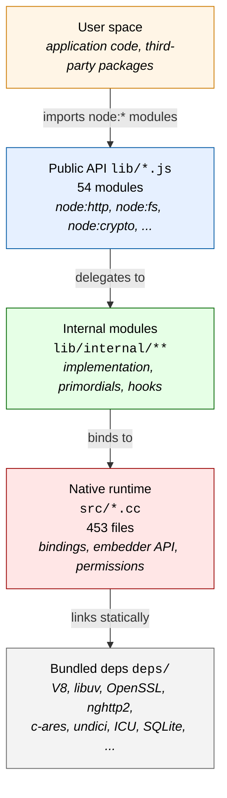

# Architecture overview

This page presents the layered architecture of Node.js v26.0.0-pre (`NODE_MAJOR_VERSION 26`,
`NODE_MODULE_VERSION 144`, `NODE_API_SUPPORTED_VERSION_MAX 10`, `NODE_VERSION_IS_RELEASE 0`, as
recorded in `src/node_version.h`). It is the high-level orientation that subsequent feature
deep-dives build on. For a feature-by-feature catalog, see [Feature catalog](features.md). For an
integration viewpoint (application, addon, embedder personas), see [Integration](integration.md).

## Architectural style

Node.js is an **event-driven**, **non-blocking I/O** runtime that embeds the V8 JavaScript engine
and the libuv asynchronous I/O abstraction. The runtime is organized as a **layered modular system**
in which each layer presents a stable contract to the layer above and consumes services from the
layer below. Concurrency is built around a single-threaded event loop with optional worker threads
(separate V8 isolates) and a process-level cluster fan-out for multi-core deployments.

The runtime is shipped as a single statically linked binary (`out/Release/node` after a release
build). The build flow is documented in
[`../contributing/development-overview.md`](../contributing/development-overview.md); the bundled
dependencies are cataloged in [Dependencies](dependencies.md).

## The five layers

### Layer 1 — User space

User-supplied JavaScript and TypeScript code, plus third-party npm packages, run on top of the
runtime. The runtime imposes no constraints on application code beyond the standard
[`package.json`](../api/packages.md) module-resolution rules.

### Layer 2 — Public API (`lib/`)

The 54 public modules under `lib/` define the runtime's stable, documented surface. These modules
are bound to the `node:` URL scheme (e.g., `import http from 'node:http'`) and have one-to-one
documentation under [`../api/`](../api/). Examples:

| Module         | Source                  | Reference                                              |
| -------------- | ----------------------- | ------------------------------------------------------ |
| HTTP/1.1       | `lib/http.js`           | [`../api/http.md`](../api/http.md)                     |
| HTTP/2         | `lib/http2.js`          | [`../api/http2.md`](../api/http2.md)                   |
| File system    | `lib/fs.js`             | [`../api/fs.md`](../api/fs.md)                         |
| Crypto         | `lib/crypto.js`         | [`../api/crypto.md`](../api/crypto.md)                 |
| Worker threads | `lib/worker_threads.js` | [`../api/worker_threads.md`](../api/worker_threads.md) |
| Test runner    | `lib/test.js`           | [`../api/test.md`](../api/test.md)                     |
| Streams        | `lib/stream.js`         | [`../api/stream.md`](../api/stream.md)                 |

Public modules typically delegate the bulk of their work to internal modules, exposing only the
stable, documented surface to user code.

### Layer 3 — Internal modules (`lib/internal/`)

`lib/internal/` is the runtime's implementation layer. It hosts:

* Module-specific implementations (e.g., `lib/internal/http2/`, `lib/internal/fs/`,
  `lib/internal/streams/`, `lib/internal/crypto/`, `lib/internal/quic/`,
  `lib/internal/webstreams/`)
* Cross-cutting primordials (`lib/internal/per_context/primordials.js`) that resist prototype
  pollution
* Lifecycle hooks (`lib/internal/process/permission.js`, `lib/internal/process/pre_execution.js`)
* Encoding helpers, error formatters, and validation utilities

The contract between `lib/` (public) and `lib/internal/` (internal) is documented in
[`../contributing/internal-api.md`](../contributing/internal-api.md). Internal modules are off-limits
to user code; their semantics may change without notice.

### Layer 4 — Native runtime (`src/`)

The 453 C++ source files under `src/` implement the bindings between JavaScript and the bundled
C/C++ dependencies. Notable subdirectories:

| Subdirectory       | File count | Subject                                                                            |
| ------------------ | ---------- | ---------------------------------------------------------------------------------- |
| `src/` (top-level) | \~250      | Bootstrap, env, bindings, JS-C++ glue                                              |
| `src/api/`         | 8          | Public C++ embedder API (consumed by [`../api/embedding.md`](../api/embedding.md)) |
| `src/crypto/`      | 62         | Cryptography bindings to OpenSSL                                                   |
| `src/inspector/`   | 49         | Chrome DevTools inspector protocol                                                 |
| `src/quic/`        | 33         | QUIC transport (ngtcp2 / nghttp3)                                                  |
| `src/permission/`  | 17         | Permission model enforcement (see [Permission model](permission-model.md))         |
| `src/tracing/`     | 11         | Trace events                                                                       |
| `src/large_pages/` | 3          | Hugetlb / large-pages memory mapping                                               |
| `src/dataqueue/`   | 2          | Internal data queue helpers                                                        |
| `src/res/`         | 3          | Embedded resources                                                                 |

The single entry point is `src/node_main.cc`, which performs argument parsing, sets up
per-process state, and hands off to the V8 isolate.

### Layer 5 — Bundled dependencies (`deps/`)

The `deps/` directory ships the third-party libraries that the runtime statically links against.
The core set is V8 (with the embedder string `-node.17` declared in `common.gypi`, indicating 17
Node.js patches against upstream V8), libuv (cross-platform async I/O), and OpenSSL (cryptography).
The full list and the per-dependency build toggles (`node_use_openssl`, `node_use_amaro`,
`node_use_sqlite`, `node_shared_*`) are cataloged in [Dependencies](dependencies.md).

## Architectural principles

The runtime adheres to five architectural principles that shape every layer of the system.

### Single-threaded event loop

The default execution model is one V8 isolate driven by one libuv loop, with I/O multiplexed via
`epoll` (Linux), `kqueue` (macOS, BSD), and `IOCP` (Windows). Worker threads
(`lib/worker_threads.js`) opt into additional isolates.

### Layered modules

Each layer (`lib/` → `lib/internal/` → `src/` → `deps/`) presents a stable contract to its
consumer. Cross-layer leakage is forbidden by the
[Internal API guide](../contributing/internal-api.md).

### Static linking

The default build statically links V8, libuv, OpenSSL, nghttp2, c-ares, undici, ICU, SQLite, Amaro,
simdutf, zlib, brotli, zstd, ngtcp2, and nghttp3 into a single `node` binary. Shared-library
variants are available via `--shared`, `--shared-openssl`, `--shared-libuv`, `--shared-zlib`, and
`--shared-v8`.

### Cross-platform abstraction

libuv abstracts file system, networking, timers, signals, and process management across Linux,
macOS, Windows, AIX, and FreeBSD. The compiler matrix is documented in
[`../../BUILDING.md`](../../BUILDING.md).

### Compile-time toggling

Optional features (Amaro type stripping, SQLite, OpenSSL, snapshots, code cache, FIPS mode) are
gated by GYP toggles in `common.gypi` and `node.gyp`, switchable at `./configure` time.

## System boundaries

The `node` binary is the runtime's outer boundary. Every interaction enters through one of three
entry points:

1. **CLI invocation** (`node script.js`, `node --eval`, `node --test`) — `src/node_main.cc` parses
   arguments and starts an isolate.
2. **Embedded library** (C++ embedder API) — `src/api/` exposes the embedding contract documented at
   [`../api/embedding.md`](../api/embedding.md).
3. **Native addon** (Node-API, formerly N-API) — addons load via `process.dlopen` and call into the
   runtime through `napi_*` symbols documented at [`../api/n-api.md`](../api/n-api.md). The
   supported ABI version range is `NODE_API_SUPPORTED_VERSION_MIN 1` through
   `NODE_API_SUPPORTED_VERSION_MAX 10` (declared in `src/node_version.h`).

For a viewpoint organized around these three integration personas, see [Integration](integration.md).

## Version constants

The constants in `src/node_version.h` are the single source of truth for runtime versions:

| Constant                              | Value | Meaning                                                           |
| ------------------------------------- | ----- | ----------------------------------------------------------------- |
| `NODE_MAJOR_VERSION`                  | `26`  | The major release line                                            |
| `NODE_MINOR_VERSION`                  | `0`   | Minor revision                                                    |
| `NODE_PATCH_VERSION`                  | `0`   | Patch revision                                                    |
| `NODE_VERSION_IS_RELEASE`             | `0`   | `0` indicates a pre-release build (the suffix `-pre` is appended) |
| `NODE_VERSION_IS_LTS`                 | `0`   | `0` indicates a non-LTS line                                      |
| `NODE_MODULE_VERSION`                 | `144` | Native module ABI version (`process.versions.modules`)            |
| `NODE_API_SUPPORTED_VERSION_MIN`      | `1`   | Lowest Node-API version the runtime supports                      |
| `NODE_API_SUPPORTED_VERSION_MAX`      | `10`  | Highest Node-API version the runtime supports                     |
| `NODE_API_DEFAULT_MODULE_API_VERSION` | `8`   | Default ABI version chosen by addons when unspecified             |

The V8 embedder string `-node.17` (declared in `common.gypi`) signals that 17 Node.js-specific
patches are applied against the upstream V8 version. The patch count is incremented each time a new
Node.js patch lands in `deps/v8/`.

## Cross-references

* Feature-by-feature catalog: [Feature catalog](features.md)
* Integration narrative: [Integration](integration.md)
* Bundled dependencies and build flags: [Dependencies](dependencies.md)
* Public API reference: [`../api/index.md`](../api/index.md)
* C++ embedder API: [`../api/embedding.md`](../api/embedding.md)
* Node-API for native addons: [`../api/n-api.md`](../api/n-api.md)
* Internal API contract: [`../contributing/internal-api.md`](../contributing/internal-api.md)
* Components in core: [`../contributing/components-in-core.md`](../contributing/components-in-core.md)
* Build and platform requirements: [`../../BUILDING.md`](../../BUILDING.md)
* Glossary of terms: [`../../glossary.md`](../../glossary.md)
