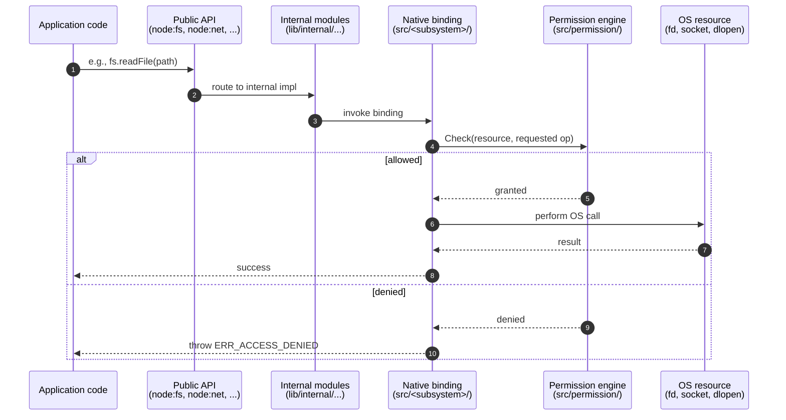

# Permission model

> Feature: F-012 — Permission Model (`--permission`, `process.permission`)

This page deep-dives into the Node.js v26.0.0-pre Permission Model, a default-deny enforcement layer
that gates file-system, network, child-process, worker, addon, and WASI access when the runtime is
launched with `--permission`. The version stamps are `NODE_MAJOR_VERSION 26`,
`NODE_MODULE_VERSION 144`, `NODE_API_SUPPORTED_VERSION_MAX 10`, `NODE_VERSION_IS_RELEASE 0`, as
recorded in `src/node_version.h`.

For an overview of the runtime layers, see [Architecture overview](overview.md). For the API
reference, see [`../api/permissions.md`](../api/permissions.md). For the project's broader security
posture, see [`../../SECURITY.md`](../../SECURITY.md) and
[`../contributing/security-model-strategy.md`](../contributing/security-model-strategy.md).

## Threat model and intent

The Permission Model is a "seat belt" mechanism: it prevents trusted code from unintentionally
touching resources it should not, and it provides defense-in-depth for sandboxed scenarios. It is
**not** a sandbox against malicious code — Node.js's overall security model assumes that any code
the runtime is asked to run is trusted (per [`../../SECURITY.md`](../../SECURITY.md)). For details,
see [`../api/permissions.md`](../api/permissions.md) under "Process-based permissions".

## Native enforcement (`src/permission/`)

The Permission Model is implemented in the native `src/permission/` directory (17 files). Each
resource type has its own enforcement source:

| Resource | Source files |
| --- | --- |
| File system | `src/permission/fs_permission.cc`, `src/permission/fs_permission.h` |
| Network | `src/permission/net_permission.cc`, `src/permission/net_permission.h` |
| Child processes | `src/permission/child_process_permission.cc`, `src/permission/child_process_permission.h` |
| Worker threads | `src/permission/worker_permission.cc`, `src/permission/worker_permission.h` |
| Native addons | `src/permission/addon_permission.cc`, `src/permission/addon_permission.h` |
| WASI | `src/permission/wasi_permission.cc`, `src/permission/wasi_permission.h` |
| Inspector | `src/permission/inspector_permission.cc`, `src/permission/inspector_permission.h` |
| Coordination | `src/permission/permission.cc`, `src/permission/permission.h`, `src/permission/permission_base.h` |

Each binding (file system, networking, etc.) consults the corresponding permission resource before
performing privileged operations. If the requested operation is not allowed, the binding throws
`ERR_ACCESS_DENIED`.

## Default-deny model

When the runtime is launched with `--permission`, every resource type enters a deny-by-default
state. To re-grant access, the user passes one or more allow-flags. Examples:

```bash
# Permission off (default) — all access permitted
node app.js

# Permission on; deny-by-default — most operations now throw ERR_ACCESS_DENIED
node --permission app.js

# Permission on; permit reading from /etc/hosts only
node --permission --allow-fs-read='/etc/hosts' app.js

# Permission on; permit reading and writing under /tmp
node --permission --allow-fs-read='/tmp/*' --allow-fs-write='/tmp/*' app.js

# Permission on; permit network access and child process spawning
node --permission --allow-net --allow-child-process app.js

# Permission on; permit worker creation and WASI access
node --permission --allow-worker --allow-wasi app.js

# Permission on; permit native addon loading (CAUTION — addons run at runtime privilege)
node --permission --allow-addons app.js
```

## Allow-flag reference

| Flag | Resource | Argument | Effect |
| --- | --- | --- | --- |
| `--allow-fs-read` | File system reads | `*`, absolute path, prefix, or glob | Allow reading the matching paths |
| `--allow-fs-write` | File system writes | `*`, absolute path, prefix, or glob | Allow writing the matching paths |
| `--allow-net` | Network sockets | (no value) | Allow `node:net`, `node:dgram`, `node:dns`, TLS/HTTP/HTTP2/QUIC |
| `--allow-child-process` | Child processes | (no value) | Allow `node:child_process` operations |
| `--allow-worker` | Worker threads | (no value) | Allow `node:worker_threads` worker creation |
| `--allow-wasi` | WASI runtime | (no value) | Allow `node:wasi` |
| `--allow-addons` | Native addons | (no value) | Allow `process.dlopen()` and `require()` of `*.node` files |

`--allow-net` also enables the global `fetch()` (which is backed by undici) and inbound listening
sockets for `node:http`, `node:https`, and `node:http2` servers. The full flag specification,
including escaping rules and globbing semantics, is at
[`../api/permissions.md`](../api/permissions.md) and [`../api/cli.md`](../api/cli.md).

## Enforcement flow



## Process-permission API

The runtime exposes the current permission state through `process.permission`:

```mjs
if (!process.permission.has('fs.read', '/etc/hosts')) {
  throw new Error('not permitted to read /etc/hosts');
}
process.permission.has('net'); // boolean
```

```cjs
if (!process.permission.has('fs.read', '/etc/hosts')) {
  throw new Error('not permitted to read /etc/hosts');
}
process.permission.has('net'); // boolean
```

The full surface (`process.permission.has(scope, ref)`) is at
[`../api/permissions.md`](../api/permissions.md) and the implementation lives at
`lib/internal/process/permission.js`.

## Cross-cutting enforcement

The Permission Model interacts with several runtime subsystems documented elsewhere in this
directory:

* **[File system](file-system.md):** `--allow-fs-read` and `--allow-fs-write` gate every `node:fs`
  read and write, including streams (`createReadStream`, `createWriteStream`), watchers, and
  `fs.cp`.
* **[Networking](networking.md):** `--allow-net` gates `node:net`, `node:dgram`, `node:dns`
  resolution, `node:tls`, `node:http`, `node:https`, `node:http2`, `node:quic`, and the global
  `fetch()`.
* **[Concurrency](concurrency.md):** `--allow-child-process` gates `node:child_process` (`spawn`,
  `exec`, `execFile`, `fork`); `--allow-worker` gates `node:worker_threads`.
* **WASI:** `--allow-wasi` gates `node:wasi` (see [`../api/wasi.md`](../api/wasi.md)).
* **Native addons:** `--allow-addons` gates `process.dlopen()` and `require()` of `*.node` files.

The Inspector (see [Diagnostics](diagnostics.md)) is also gated by the permission engine through
`src/permission/inspector_permission.cc`; the Inspector cannot be enabled if the permission engine
denies it.

## Known constraints

The current implementation has several documented constraints that users should account for:

* **Permission state does not propagate into worker threads.** Each worker boots its own permission
  engine. To enforce the same restrictions in workers, pass the corresponding flags via `Worker`
  `execArgv` or `WorkerOptions`.
* **Symlink resolution can subvert path-based allow lists.** If `/safe/link.txt` is a symlink to
  `/secret/data`, allowing `/safe/*` may unintentionally allow reads of `/secret/data` because
  resolution happens at the OS level. Use canonical paths in allow specifications and avoid
  symlinks crossing trust boundaries.
* **`--env-file` and `--openssl-config` are processed before the permission engine initializes.**
  Both are loaded during early startup, before `--permission` takes effect; consequently,
  file-system access for these flags is not subject to allow-flag gating.
* **`--permission` cannot be revoked at runtime.** Once enabled at startup, the permission state
  can be queried and tightened (`process.permission.has(...)` is read-only); there is no mechanism
  to disable enforcement after the runtime starts.

The complete list of caveats is enumerated in [`../api/permissions.md`](../api/permissions.md) under
"Limitations and Known Issues".

## Cross-references

* Architectural overview: [Architecture overview](overview.md)
* Feature catalog: [Feature catalog](features.md)
* Integration narrative: [Integration](integration.md)
* File system (`--allow-fs-read`, `--allow-fs-write`): [File system](file-system.md)
* Networking (`--allow-net`): [Networking](networking.md)
* Concurrency (`--allow-child-process`, `--allow-worker`): [Concurrency](concurrency.md)
* Diagnostics (Inspector permission): [Diagnostics](diagnostics.md)
* Public APIs:
  * [`../api/permissions.md`](../api/permissions.md)
  * [`../api/cli.md`](../api/cli.md)
  * [`../api/process.md`](../api/process.md)
  * [`../api/wasi.md`](../api/wasi.md)
  * [`../api/addons.md`](../api/addons.md)
* Project security policy: [`../../SECURITY.md`](../../SECURITY.md)
* Security release process: [`../contributing/security-release-process.md`](../contributing/security-release-process.md)
* Security model strategy: [`../contributing/security-model-strategy.md`](../contributing/security-model-strategy.md)
