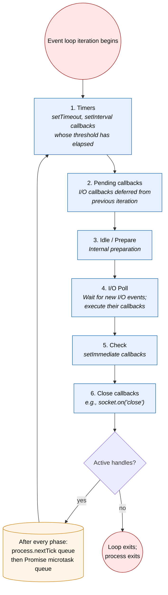
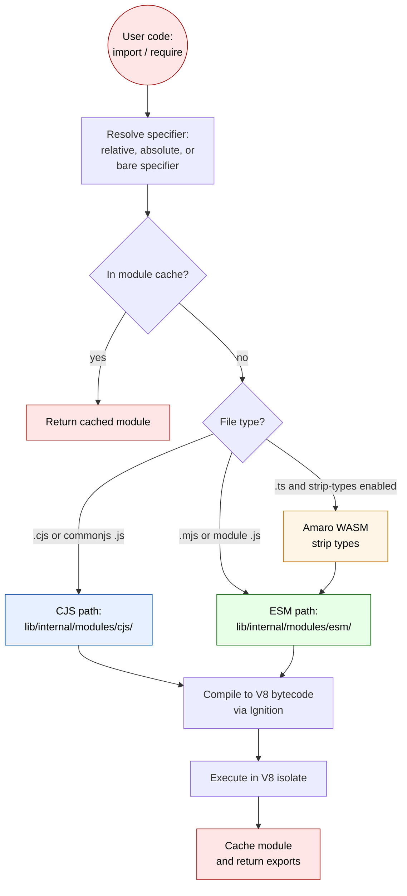

# JavaScript runtime

> Feature: F-001 — JavaScript runtime (V8 integration, libuv event loop, module system, JIT pipeline)

This page deep-dives into how Node.js v26.0.0-pre runs JavaScript. It covers the V8 engine
integration (with embedder string `-node.17` per `common.gypi`), the libuv event loop, the ESM and
CJS module systems, and the JIT compilation pipeline. The version stamps are
`NODE_MAJOR_VERSION 26`, `NODE_MODULE_VERSION 144`, sourced from `src/node_version.h`.

For an overview of the runtime layers, see [Architecture overview](overview.md). For the catalog
that places this feature in context, see [Feature catalog](features.md). For bundled-dependency
details (V8, libuv), see [Dependencies](dependencies.md).

## V8 integration

V8 is bundled under `deps/v8/` and statically linked into the `node` binary by default. The
embedder string declared in `common.gypi` is:

```text
'v8_embedder_string': '-node.17',
```

The trailing number (`17`) reflects the count of Node.js-specific patches applied against the
upstream V8 release. Each new patch increments the count. The patch series and update workflow are
governed by [`../contributing/maintaining/maintaining-V8.md`](../contributing/maintaining/maintaining-V8.md).

V8 is exposed to user code through three channels:

| Channel                                                           | Reference                                                                    |
| ----------------------------------------------------------------- | ---------------------------------------------------------------------------- |
| `node:v8` module (heap stats, code cache, snapshots, performance) | [`../api/v8.md`](../api/v8.md)                                               |
| Inspector protocol (Chrome DevTools)                              | [Diagnostics](diagnostics.md), [`../api/inspector.md`](../api/inspector.md)  |
| Native addons (V8 directly via `<v8.h>` or via Node-API)          | [`../api/addons.md`](../api/addons.md), [`../api/n-api.md`](../api/n-api.md) |

For build-time toggles that affect V8 (`node_use_v8_platform`, `node_use_bundled_v8`,
`node_shared_v8`, `node_use_node_snapshot`, `node_use_node_code_cache`), see
[Dependencies](dependencies.md).

## libuv event loop

libuv (bundled at `deps/uv/`) provides the single-threaded, non-blocking I/O abstraction that
underlies all asynchronous APIs in Node.js. The event loop runs through six phases per turn,
checking microtasks (process.nextTick and Promise jobs) between every phase.



The event-loop lifecycle is described in detail in
[`../api/process.md`](../api/process.md), including the `process.nextTick` and microtask interleaving
semantics. The `node:async_hooks` API documented in [`../api/async_hooks.md`](../api/async_hooks.md)
exposes lifecycle hooks for user code that needs to track resource creation, before/after callback
execution, and resource destruction.

The interaction between the event loop and worker threads (which each run their own libuv loop and
V8 isolate) is covered in [Concurrency](concurrency.md) and [`../api/worker_threads.md`](../api/worker_threads.md).

## Module systems

Node.js supports both **CommonJS** (CJS) and **ECMAScript Modules** (ESM). The selection is driven
by file extension and the closest `package.json` `"type"` field:

| Selector                      | CJS                       | ESM                     |
| ----------------------------- | ------------------------- | ----------------------- |
| File extension                | `.cjs`                    | `.mjs`                  |
| `package.json` `"type"` field | `"commonjs"` (default)    | `"module"`              |
| `.js` files                   | when `"type": "commonjs"` | when `"type": "module"` |
| Programmatic loader           | `require()`               | dynamic `import()`      |

Implementation surface:

| Loader              | Public module                           | Internal implementation                                                |
| ------------------- | --------------------------------------- | ---------------------------------------------------------------------- |
| CJS                 | `lib/module.js` (the `node:module` API) | `lib/internal/modules/cjs/`                                            |
| ESM                 | `lib/module.js` (shared API surface)    | `lib/internal/modules/esm/`                                            |
| Bootstrap           | (none)                                  | `lib/internal/bootstrap/`, `lib/internal/modules/run_main.js`          |
| Customization hooks | `node:module` `register()` API          | `lib/internal/modules/customization_hooks.js`                          |
| Package.json reader | (none)                                  | `lib/internal/modules/package_json_reader.js`                          |
| TypeScript          | (transparent)                           | `lib/internal/modules/typescript.js` (see [TypeScript](typescript.md)) |
| Helpers             | (none)                                  | `lib/internal/modules/helpers.js`                                      |

### Module loading flow



For the public API surface, see [`../api/module.md`](../api/module.md). For the CJS-specific
behavior, see [`../api/modules.md`](../api/modules.md). For the ESM-specific behavior, see
[`../api/esm.md`](../api/esm.md). For the package format and exports, see
[`../api/packages.md`](../api/packages.md). For TypeScript handling, see
[TypeScript](typescript.md) and [`../api/typescript.md`](../api/typescript.md).

## JIT compilation pipeline

V8 compiles JavaScript through a four-stage pipeline:

| Tier          | Speed                         | Memory cost | Trigger                                        |
| ------------- | ----------------------------- | ----------- | ---------------------------------------------- |
| **Ignition**  | Slow (interpreter)            | Low         | Initial entry — every function starts here     |
| **SparkPlug** | Faster (baseline JIT)         | Low-medium  | Hot enough to compile, but not optimized       |
| **Maglev**    | Fast (mid-tier optimizing)    | Medium      | Frequently executed; a quick path to good code |
| **TurboFan**  | Fastest (top-tier optimizing) | High        | Repeatedly hot in the same shape               |

The tier handoff is automated by V8 based on type-feedback signals collected during execution.
Runtime-tunable knobs are exposed via V8 flags (e.g., `--no-opt`, `--turbo-only`); the canonical
list is at `node --v8-options`. The `node:v8` module ([`../api/v8.md`](../api/v8.md)) exposes
heap and JIT statistics for diagnostics.

For a deeper exploration of how to profile V8 code, see the diagnostics narrative at
[Diagnostics](diagnostics.md).

## Bootstrap sequence

The runtime boots through these stages, all coordinated by `src/node_main.cc` and the JavaScript
under `lib/internal/bootstrap/`:

1. **Native init** — `src/node_main.cc` parses CLI args, calls `node::InitializeNodeWithArgs`, sets
   up V8 platform.
2. **V8 isolate creation** — a `v8::Isolate` is created (with optional snapshot from
   `node_use_node_snapshot=true`) and a per-process `node::Environment` is initialized
   (`src/api/environment.cc`).
3. **JS bootstrap** — `lib/internal/bootstrap/realm.js` and the `node:` core modules are wired up.
4. **User script entry** — `lib/internal/modules/run_main.js` resolves and executes the user's
   entry point (or starts the REPL).
5. **Loop run** — the libuv event loop runs until no active handles remain, after which the process
   exits.

The embedder lifecycle (steps 1–3 from a host application's perspective) is documented in
[`../api/embedding.md`](../api/embedding.md). For the user-facing process lifecycle (`exit`,
`beforeExit`, `SIGINT`, `process.exitCode`), see [`../api/process.md`](../api/process.md).

## Globals exposed to user code

The runtime exposes the standard ECMAScript globals plus a Node.js-specific surface
(`process`, `Buffer`, `__dirname`, `__filename`, `require` and `module` in CJS, `globalThis`,
WHATWG/Web Standards globals such as `fetch`, `Request`, `Response`, `Headers`, `FormData`, `Blob`,
`crypto.subtle`). The complete catalog is at [`../api/globals.md`](../api/globals.md). For Web
Standards alignment specifically, see [Web standards](web-standards.md).

## Cross-references

* Architectural overview: [Architecture overview](overview.md)
* Feature catalog: [Feature catalog](features.md)
* Integration narrative: [Integration](integration.md)
* Bundled dependencies (V8, libuv details): [Dependencies](dependencies.md)
* Concurrency (worker threads, child processes): [Concurrency](concurrency.md)
* Diagnostics (Inspector, perf hooks): [Diagnostics](diagnostics.md)
* TypeScript handling: [TypeScript](typescript.md)
* Web Standards: [Web standards](web-standards.md)
* Public APIs:
  * [`../api/cli.md`](../api/cli.md)
  * [`../api/module.md`](../api/module.md)
  * [`../api/modules.md`](../api/modules.md)
  * [`../api/esm.md`](../api/esm.md)
  * [`../api/packages.md`](../api/packages.md)
  * [`../api/process.md`](../api/process.md)
  * [`../api/v8.md`](../api/v8.md)
  * [`../api/globals.md`](../api/globals.md)
  * [`../api/async_hooks.md`](../api/async_hooks.md)
* Components in core: [`../contributing/components-in-core.md`](../contributing/components-in-core.md)
* Build flags reference: [`../../BUILDING.md`](../../BUILDING.md)
* Glossary of terms: [`../../glossary.md`](../../glossary.md)
