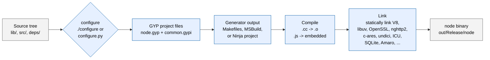

# Development overview

> Scope: This document indexes the **development** workflows for the Node.js project. It
> complements the [Testing overview](testing-overview.md), which covers the **testing** workflows
> (test execution, coverage, linting runs, benchmarks, CI gates, security scans). Concerns that are
> exclusively about validating the runtime — running the test suite, measuring coverage, or
> reviewing CI status — are intentionally deferred to the testing overview. Building, configuring,
> debugging, code style, dependency maintenance, and releases are covered here.

This page synthesizes every development-related artifact in the repository into one navigable
index. The existing detailed contributor guides (e.g., [Pull requests](pull-requests.md),
[C++ style guide](cpp-style-guide.md), [Releases](releases.md),
[Collaborator guide](collaborator-guide.md)) are preserved as authoritative deep-dives. This
document links out to those guides rather than duplicating their content.

The version of Node.js documented here is **v26.0.0-pre** (`NODE_MAJOR_VERSION 26`,
`NODE_MODULE_VERSION 144`, `NODE_API_SUPPORTED_VERSION_MAX 10`, `NODE_VERSION_IS_RELEASE 0`), as
recorded in `src/node_version.h`.

## Table of contents

* [Build pipeline](#build-pipeline)
* [Building from source](#building-from-source)
* [Configuring](#configuring)
* [Code style](#code-style)
* [Adding native APIs](#adding-native-apis)
* [Maintaining bundled dependencies](#maintaining-bundled-dependencies)
* [Submitting changes](#submitting-changes)
* [Releases and backporting](#releases-and-backporting)
* [Debugging](#debugging)
* [Onboarding](#onboarding)
* [Documentation](#documentation)
* [Cross-references](#cross-references)

## Build pipeline

The Node.js build flows through five distinct stages, all driven by the `Makefile` (Unix and macOS)
or `vcbuild.bat` (Windows). The diagram below summarizes the path from source code to the final
`node` binary:

<!--lint disable fenced-code-flag-->



<!--lint enable fenced-code-flag-->

The `configure` script is a thin shell wrapper around `configure.py`, which discovers the host and
target platforms, sets the build toggles defined in `common.gypi`, and emits a GYP project. GYP
then generates the platform-specific build files (Makefile on Unix and macOS, MSBuild on Windows,
or Ninja when requested explicitly). The compile and link stages produce the final `node` binary
under `out/Release/` (or `out/Debug/` for debug builds).

## Building from source

The canonical build commands are documented in [`../../BUILDING.md`](../../BUILDING.md), which also
enumerates the supported platforms, compiler toolchains, and Python versions. The most common
invocations are:

```bash
# Unix and macOS: configure with default options and build the Release variant
./configure
make -j"$(getconf _NPROCESSORS_ONLN)"

# Build a debug variant alongside the release variant
./configure --debug
make -j"$(getconf _NPROCESSORS_ONLN)" all

# Install into $PREFIX (default /usr/local)
make install

# Remove build artifacts
make clean

# Remove build, test, and coverage artifacts
make distclean
```

For Windows, the entry point is `vcbuild.bat`:

```text
vcbuild release
vcbuild debug
vcbuild test
```

Two alternative build systems are also supported:

* **Ninja** — a faster generator for incremental builds. The setup is documented in
  [Building Node.js with Ninja](building-node-with-ninja.md).
* **GN** — Google's build configuration system, used by Chromium. See [GN build](gn-build.md).

For platforms with limited toolchain support, the project provides a reproducible
`devcontainer` definition; see [Using a devcontainer](using-devcontainer.md).

## Configuring

The `configure` script (`configure.py`) accepts a wide range of options that flip build-time
toggles in `common.gypi` and `node.gypi`. Notable toggles include:

* `--prefix=<path>` — installation prefix
* `--debug` — build a debug variant alongside the release
* `--shared` — build the runtime as a shared library
* `--shared-openssl`, `--shared-libuv`, `--shared-zlib`, `--shared-v8` — link a system copy of the
  dependency instead of the bundled one
* `--without-intl`, `--with-intl=full-icu` — disable or enable full ICU
* `--openssl-no-asm` — disable OpenSSL hand-written assembly (for unsupported toolchains)
* `--enable-asan` — compile with AddressSanitizer instrumentation
* `--enable-lto` — enable link-time optimization
* `--ninja` — emit Ninja project files instead of Makefiles

The corresponding GYP variables are surfaced through `common.gypi`. Examples include:

* `node_use_openssl` — enable OpenSSL backing for the `crypto` module (default: `true`)
* `node_use_amaro` — enable the Amaro WASM type stripper for `--experimental-strip-types` (default
  varies by platform)
* `node_use_sqlite` — enable the bundled SQLite database (default: `true`)
* `node_shared`, `node_shared_libuv`, `node_shared_openssl`, ... — switch between bundled and
  shared builds of each dependency
* The V8 embedder string `-node.17` is also defined in `common.gypi` and indicates the count of
  Node.js-specific patches applied on top of upstream V8.

Run `./configure --help` for the complete option list. The full matrix of configuration recipes
(FIPS-compliant OpenSSL, Temporal support, custom ICU, external core modules) is documented in
[`../../BUILDING.md`](../../BUILDING.md).

## Code style

The project enforces consistent code style across five languages. Formatting and linting tools
are invoked through `Makefile` targets, but the configuration files and style guides are language
specific:

* **C++** — formatter `clang-format`; linter `cpplint.py`. See the
  [C++ style guide](cpp-style-guide.md), the `.clang-format` rules, and `.cpplint` for the lint
  configuration.
* **JavaScript** — formatter and linter ESLint (auto-fix with `eslint --fix`). Configuration in
  `eslint.config.mjs`; [Pull requests](pull-requests.md) step 3 (Code) covers the commit-time
  style rules.
* **Python** — linter `ruff`. Configuration in `pyproject.toml` (`target-version = "py310"`,
  `line-length = 172`).
* **YAML** — linter `yamllint`. Configuration in `.yamllint.yaml`.
* **Markdown** — formatter `make format-md`; linter `@eslint/markdown` via ESLint. See the
  [Documentation style guide](../README.md).

The C++ linter is configured via `.cpplint` with `set noparent`, `linelength=80`, and a filter
that disables the `-build/c++17`, `-build/include_alpha`, `-build/include_subdir`,
`-build/include_what_you_use`, `-legal/copyright`, `-readability/nolint`, `-readability/braces`,
and `-whitespace/indent_namespace` checks.

For C++ contributors, see [C++ style guide](cpp-style-guide.md) for naming conventions, indentation
rules, memory-management idioms, and the policy on throwing JavaScript errors from C++ methods.
The companion [`../../src/README.md`](../../src/README.md) covers C++ codebase idioms that fall
outside the formatting style guide. For working with internal JavaScript primitives that resist
prototype pollution, see [Primordials](primordials.md). For internal versus public API boundaries,
see [Internal API](internal-api.md). For module-level component organization, see
[Components in core](components-in-core.md).

To auto-fix JavaScript formatting issues:

```bash
make lint-js-fix
```

To auto-format Markdown files:

```bash
make format-md
```

To auto-format C++ files:

```bash
make format-cpp
```

The Make targets that run the linters (`make lint`, `make lint-md`, `make lint-cpp`, etc.) are
covered in the companion [Testing overview](testing-overview.md).

## Adding native APIs

Two pathways exist for adding native APIs:

* **Node-API (formerly N-API)** — the ABI-stable C interface for native addons. New Node-API
  functions follow the workflow in [Adding a new Node-API](adding-new-napi-api.md). The
  ABI-versioning rules and the supported version range (`NODE_API_SUPPORTED_VERSION_MIN 1`
  through `NODE_API_SUPPORTED_VERSION_MAX 10`) are governed by
  [Releases (Node-API)](releases-node-api.md).
* **V8 fast API** — the V8-specific path for fast-call paths used by hot core APIs. The workflow
  is documented in [Adding a V8 fast API](adding-v8-fast-api.md).

The reference for the C++ embedder API is [`../api/embedding.md`](../api/embedding.md), and the
Node-API reference for native addons is [`../api/n-api.md`](../api/n-api.md).

## Maintaining bundled dependencies

The Node.js binary statically links a number of bundled dependencies under `deps/`. Each major
dependency has a dedicated maintainer guide in the [`maintaining/`](maintaining/) subfolder:

* [Maintaining V8](maintaining/maintaining-V8.md) — V8 JavaScript engine
* [Maintaining OpenSSL](maintaining/maintaining-openssl.md) — OpenSSL cryptography library
* [Maintaining ICU](maintaining/maintaining-icu.md) — ICU (internationalization)
* [Maintaining HTTP](maintaining/maintaining-http.md) — llhttp and nghttp2
* [Maintaining root certs](maintaining/maintaining-root-certs.md) — Trusted root certificates
* [Maintaining WebAssembly](maintaining/maintaining-web-assembly.md) — WebAssembly toolchain
* [Shared-library support](maintaining/maintaining-shared-library-support.md) — Shared-library build mode
* [Single executable applications](maintaining/maintaining-single-executable-application-support.md) — SEA build mode
* [The build files](maintaining/maintaining-the-build-files.md) — GYP and Makefile maintenance
* [Types for Node.js](maintaining/maintaining-types-for-nodejs.md) — TypeScript type definitions
* [Maintaining merve](maintaining/maintaining-merve.md) — merve
* [Maintaining dependencies](maintaining/maintaining-dependencies.md) — Cross-cutting dependency policy

Routine version bumps are automated by the scripts under `tools/dep_updaters/`. The CI workflows
`update-v8.yml`, `update-openssl.yml`, and `update-wpt.yml` invoke these scripts on a schedule.

## Submitting changes

Contribution policy is anchored by [`../../CONTRIBUTING.md`](../../CONTRIBUTING.md), which
describes the Developer Certificate of Origin (DCO) and the high-level workflow. The day-to-day
mechanics are covered in three guides:

* [Pull requests](pull-requests.md) — fork, branch, commit-message conventions, the rebase and
  push flow, the review process, and the approval rules
* [Collaborator guide](collaborator-guide.md) — the collaborator-side guide to reviews, breaking
  changes, deprecations, code review etiquette, internal versus public API boundaries, and the
  Jenkins / GitHub-Actions CI matrix
* [Commit queue](commit-queue.md) — the GitHub-Actions-backed automation that lands approved
  pull requests, including the labels that drive it (`commit-queue`, `commit-queue-squash`,
  `commit-queue-rebase`, `commit-queue-failed`)

For the lifecycle of issues and triage labels, see [Issues](issues.md). For the recognition of
contributors and reviewers, see [Recognizing contributors](recognizing-contributors.md). For the
project-level governance and code of conduct, see [Code of conduct](code-of-conduct.md) and the
companion [`../../GOVERNANCE.md`](../../GOVERNANCE.md).

## Releases and backporting

Long-lived release lines (Current, Active LTS, Maintenance LTS) are produced through a documented
release engineering workflow:

* [Releases](releases.md) — the canonical end-to-end release procedure for Current and LTS
  releases, including the 20-step checklist (pre-release, branching, version bump, changelog,
  signing, promotion, GitHub release, blog, announcement)
* [Backporting to release lines](backporting-to-release-lines.md) — selecting and back-porting
  fixes from `main` into the appropriate release line
* [Releases (Node-API)](releases-node-api.md) — the supplementary release engineering rules
  specific to Node-API ABI version bumps
* [Distribution](distribution.md) — the binary distribution channels (nodejs.org, package
  managers, container images)
* [`../../CHANGELOG.md`](../../CHANGELOG.md) — the canonical change log for every release line

The release schedule itself is captured in [Releases](releases.md), which links to the upstream
Node.js release-schedule repository.

## Debugging

Three guides anchor the debug workflow:

* [Investigating native memory leaks](investigating-native-memory-leaks.md) — Valgrind, ASan, and
  the structured workflow for tracking native heap leaks
* [Postmortem support](node-postmortem-support.md) — the post-mortem debugging contract,
  core-dump tooling, and the LLDB / GDB plugins
* [Diagnostic tooling support tiers](diagnostic-tooling-support-tiers.md) — the tier classification
  for diagnostic tooling and the support guarantees per tier

For runtime-side observability features (Inspector, perf hooks, async hooks, diagnostics channel,
trace events), see the API references under [`../api/`](../api/) and the architectural deep-dive
at [`../architecture/diagnostics.md`](../architecture/diagnostics.md).

## Onboarding

New collaborators should start with the top-level [`../../onboarding.md`](../../onboarding.md)
guide, which describes the access provisioning flow, the GitHub-side responsibilities, and the
recommended reading list. For local development environments, the
[Using a devcontainer](using-devcontainer.md) guide describes the project's reproducible
container-based dev environment, suitable for VS Code's Dev Containers feature and for GitHub
Codespaces.

When a collaborator steps down, the off-boarding workflow is documented in
[Offboarding](offboarding.md). The security-steward-specific lifecycle is in
[Security steward on/off-boarding](security-steward-on-off-boarding.md).

## Documentation

For documentation contributors:

* [Writing documentation for the Node.js project](writing-docs.md) — the high-level guide that
  links to the [Documentation style guide](../README.md), the build commands (`make docserve`,
  `make doc`, `make doc-only`), and the lint command (`make lint-md`)
* [API documentation tooling](api-documentation.md) — the internals of `@node-core/doc-kit` and
  the build-time pipeline that produces `out/doc/api/*.html` and `out/doc/api/*.json`

Note: while these guides describe the development side of writing documentation (authoring,
local preview, style enforcement), the validation commands (`make lint-md`, `make test-doc -j`)
that gate documentation in CI are catalogued in the companion
[Testing overview](testing-overview.md).

## Cross-references

The following documents extend the topics summarized here:

* Companion testing workflow index: [Testing overview](testing-overview.md)
* Build and platform requirements: [`../../BUILDING.md`](../../BUILDING.md)
* Project contribution policy: [`../../CONTRIBUTING.md`](../../CONTRIBUTING.md)
* Project governance: [`../../GOVERNANCE.md`](../../GOVERNANCE.md)
* Top-level onboarding: [`../../onboarding.md`](../../onboarding.md)
* Pull-request workflow: [Pull requests](pull-requests.md)
* Collaborator-side responsibilities: [Collaborator guide](collaborator-guide.md)
* Commit queue mechanics: [Commit queue](commit-queue.md)
* Release engineering: [Releases](releases.md)
* Backporting fixes to release lines: [Backporting to release lines](backporting-to-release-lines.md)
* Distribution channels: [Distribution](distribution.md)
* C++ style guide: [C++ style guide](cpp-style-guide.md)
* Internal primordials: [Primordials](primordials.md)
* Internal versus public APIs: [Internal API](internal-api.md)
* Component organization: [Components in core](components-in-core.md)
* Adding new Node-API functions: [Adding a new Node-API](adding-new-napi-api.md)
* Adding V8 fast API entries: [Adding a V8 fast API](adding-v8-fast-api.md)
* Per-dependency maintenance: [`maintaining/`](maintaining/)
* DevContainer use: [Using a devcontainer](using-devcontainer.md)
* Native memory leak investigation: [Investigating native memory leaks](investigating-native-memory-leaks.md)
* Post-mortem debugging: [Postmortem support](node-postmortem-support.md)
* Diagnostic tooling tiers: [Diagnostic tooling support tiers](diagnostic-tooling-support-tiers.md)
* Documentation authoring: [Writing docs](writing-docs.md)
* Documentation tooling internals: [API documentation](api-documentation.md)
* Off-boarding: [Offboarding](offboarding.md)
